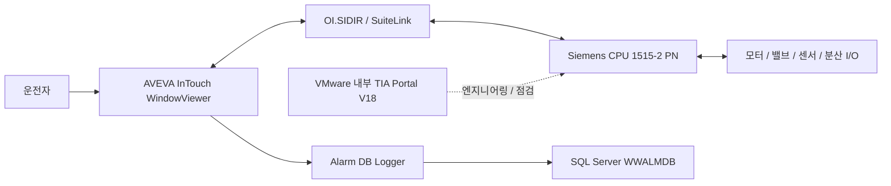

# GME 현재 프로그램의 구조와 확인 범위

작성일: 2026-10-07. 이 자료는 현재 사용 중인 HMI의 화면·설정, TIA 화면에서 관찰한 2월 프로젝트, 6월 백업 분석을 연결한다. 물리 PLC와 백업의 전체 일치 여부는 아직 미확인이다.

## 시스템 역할

HMI는 운전 요청·설정과 상태·알람 표시를 담당하고 PLC가 실제 제어 프로그램을 실행한다. VMware는 TIA 작업 환경이다. HMI의 RUN 표시나 과거 화면값만으로 현장의 통신·운전 상태를 확정하지 않는다.

## 서로 다른 기준 프로젝트

| 자료 | 확인된 대상 | 의미 |
|---|---|---|
| 실제 HMI | DECOATER SYNOPTIC, AVEVA InTouch | 사용자가 제공한 운전 화면 |
| 10월 6일 TIA 화면 | GME2025-02-12 / 102CPU / CPU 1515-2 PN | 오프라인 화면에서 일부 로직과 블록 번호 확인 |
| 주 분석 백업 | GME_20250506.zap18 내부 GME_20250605.ap18 | 6월 프로젝트 검색 색인 분석 |
| 10월 1일 백업 ZIP | TIA V18 아카이브 4개 | 기존 2025년 프로젝트를 2026년 10월 1일에 보관한 묶음 |
| 추가 프로젝트 폴더 | GME2025-02-12, GME20250212 | 바탕화면에서 발견한 전체 폴더 복사본. 서로 동일하다고 가정하지 않음 |

## PLC 실행 구성

Main [OB1]은 HMI·레시피, 입출력, 센서 변환, 알람, 모터, 필터, 게이트, 버너, 밸브와 출력, 알람 통합 및 유지보수 관련 참조를 배치한다. 색인에서 Main 네트워크 문서 15개가 확인됐다. 호출은 접점 조건과 주기 OB의 실행 영향을 함께 읽어야 한다.

| 블록 | 확인 내용 | 주요 역할 |
|---|---|---|
| Main OB1 | TIA 화면과 백업 | 순환 실행 진입 |
| CYC_INT2 / OB32 | 번호는 TIA 화면, 1초 명칭·PID Cycle은 백업 | 온도 선택, 버너 PID, Auto start motors |
| CYC_INT5 / OB35 | 번호는 TIA 화면, 100ms 명칭·PID Cycle은 백업 | 산소·압력·온도 제어, 공기/가스 비율 |
| CYC_INT4 / OB34 | 화면 번호와 200ms 명칭 | 시험용 추세. 활성 여부 미확인 |
| Startup only / OB100 | TIA 화면 번호 | 초기화와 기본 모드 |
| OB82 / OB86 / OB121 / OB122 / OB10 | TIA 화면 번호 | 진단·오류·시간 이벤트 |

주기와 우선순위의 실제 설정은 OB 속성으로 다시 검증한다. Auto start motors의 1ms 주석은 1초 블록의 호출 위치와 다르다.

## 기능과 데이터

| 영역 | 주요 블록·데이터 | 매뉴얼 |
|---|---|---|
| HMI / 레시피 | HMI, HMI inputs/output, HMI_DB, Recipes handler | 3·5장 |
| 입력 / 출력 | Inputs, Output, Word_inputs/outputs, Analog conversion | 4·5장 |
| 장치 운전 | Motors 1, Valve control loop, R1 scraps gate 2, Filter | 6·8장 |
| 자동 순서 | Auto start motors, Flag, Workdata | 7장 |
| 버너 / PID | Burner control, PID-Burner, Control_stechio, Data_PID | 12장 |
| 알람 | Allarms 1/2/3, Allarm manager, Allarm | 9·11장 |
| 이력 | Alarm DB Logger, WWALMDB, Historical Alarms | 10장 |

색인 기준 블록 속성 문서 89개와 네트워크 문서 457개를 제공한다. 이는 공식 전체 블록 수나 완전한 접점 연결을 보증하지 않는다. HMI 태그 목록은 설정 782개, 화면 메타데이터는 17개다.

## 화면과 PLC의 대표 대응

| 화면 / 태그 | 설정 주소 | 해석과 확인 과제 |
|---|---|---|
| PV_01\Flag | DB2,X5.0 | PV01 명령 참조 |
| PV_01\GateA_Open / Close | DB11,X76.1 / X76.2 | 가공된 HMI 위치 상태 |
| PV_01\GateB_Open / Close | DB11,X76.3 / X76.4 | 가공된 HMI 위치 상태 |
| PV_01\Allarme1 | DB11,X76.0 | 통합 알람 참조 |
| ResetAlarms | DB2,X13.4 | HMI Reset 요청 |
| Flag.RESET_ALLARM | DB2.DBX6.0 | Network 15에서 확인한 내부 Reset. 위 주소와 전달 경로 확인 필요 |
| Allarmi_63 | DB3,X7.6 | 유지보수 기간 제한 알람 |

물리 입력과 HMI 가공 상태를 같은 신호로 취급하지 않는다. 개방·폐쇄 방향, 정상 열림/닫힘 접점, 동시에 켜진 센서와 모두 꺼진 센서를 별도 검증한다.

## 기준 자료

- [매뉴얼 원본](manual.md), [PDF](GME_HMI_PLC_manual.pdf)
- [블록 목록](blocks.csv), [네트워크 목록](networks.csv)
- [HMI 태그](hmi_plc_tags.csv), [화면 목록](hmi_windows.csv)
- [검증 대장](verification.csv)
- [사용자 제공 HMI 스크린샷](HMI_DECOATER_SYNOPTIC_20261007.png)
