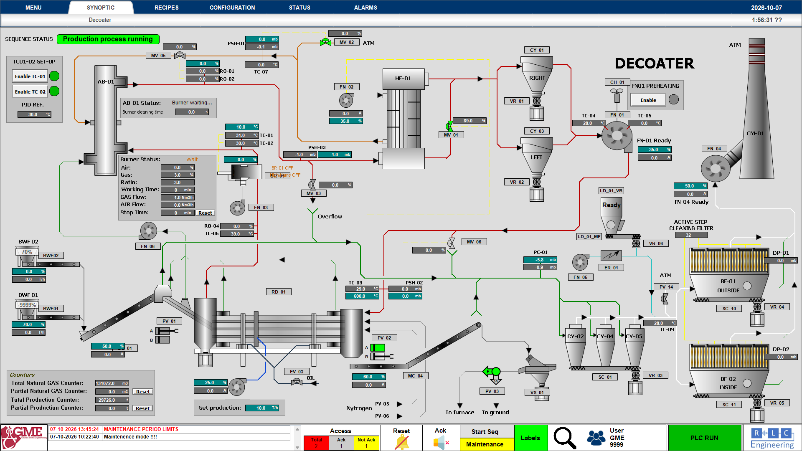
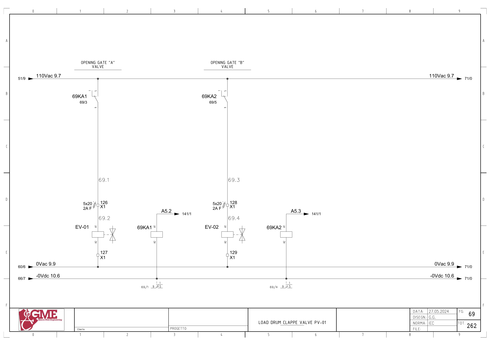
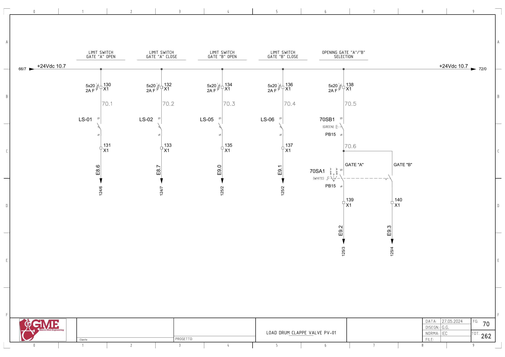

# GME PV01 이중 게이트 상세 매뉴얼 초안

문서 번호: GME-PV01-MAN-001 · 개정: 0.1 · 작성일: 2026-10-07

이 문서는 PV01을 첫 대상으로 P&ID, 전기도면, PLC 백업 분석 자료, HMI 설정을 연결한 검토용 초안이다. 배선과 주소 대응은 문서에서 확인했으며, 동작 순서와 인터록은 래더 원본 검증을 기다리는 부분을 명시했다. 현재 가동 PLC의 프로그램, 현장 센서 사용 여부, 실제 동작 시험 결과는 아직 확보하지 않았다.

완료한 작업은 자료 대조와 초안 작성이다. 아래 시뮬레이터 시험은 설계 항목이며 실행 결과가 아니다. 본 문서에 PLC 변경 또는 시험 통과 기록은 없다.

## 1. 문서의 근거와 판정 기준

| 근거 ID | 자료 | 확인 범위 | 해석 한계 |
|---|---|---|---|
| S01 | [P&ID 1684n002, Rev. I](sources/PID_1684n002I.pdf) | 1쪽, 제목·PV01·공압과 게이트 구성 | 2013-01-15 개정 자료로 현재 설비와 변경 대조 필요 |
| S02 | [전기도면 Revision 2](sources/Electrical_Rev2.pdf) | 총 265쪽 중 목차, PLC 구성, PV01, 일부 SPARE 개정 회로 | 전체 265쪽의 회로 검증 완료를 뜻하지 않음 |
| S03 | [PLC 선택 근거](sources/pv01-evidence.json) | 백업 검색 색인의 살아 있는 태그·블록·네트워크 문서 | LAD 검색 토큰은 접점 연결, 반전, 코일 종류를 보존하지 않음 |
| S04 | [HMI 태그 설정 CSV](sources/hmi_plc_tags.csv) | PV01 및 관련 명령의 설정 주소 | 온라인 현재값, 화면 객체의 쓰기 동작은 미검증 |
| S05 | [기존 HMI 공정 화면](assets/HMI_DECOATER.png) | PV01 A/B의 공정 배치 | 캡처 시점의 표시이며 현장 현재 상태를 뜻하지 않음 |
| S06 | [기존 홈페이지 매뉴얼](sources/existing-manual.md) | PV01, 실행 구조, 검증 과제의 기존 설명 | 파생 설명 자료이며 원본보다 우선하지 않음 |

PLC 분석 기준은 GitHub 저장소 `esp6662266/gme-plc-manual`의 커밋 `2ebff1273f586f3355a2ba8fb91d701ac94e4a5e`에 들어 있는 자료다. 해당 분석은 `GME_20250506.zap18`, 내부 프로젝트 `GME_20250605.ap18`을 기준으로 작성되어 있다. 별도 2월 프로젝트와 동일한 프로그램이라고 간주하지 않는다. 이 커밋은 검토 기준이며 현재 최신 커밋이라는 추가 판정은 하지 않는다.

본 문서는 다음 세 판정을 사용한다.

- **자료 확인:** 해당 파일에서 태그·주소·문구·설정값의 존재를 확인했다. 현장 검증과는 구분한다.
- **추정:** 여러 참조를 연결한 해석이다. 실제 접점 또는 동작 관찰이 추가로 필요하다.
- **확인 필요:** 도면 충돌, 미확보 정보 또는 현재 설비와의 비교 항목이다.

PLC 네트워크의 ‘색인 내 순서’는 분석 파일 안의 나열 순서다. TIA 화면에 보이는 Network 번호와 같다고 보증하지 않는다. 네트워크를 찾을 때 블록명, 제목, 참조 태그, 색인 문서 ID를 함께 사용한다.

## 2. 설비와 제어 구조

P&ID 제목은 `UBC AND SCRAPS DECOATER 10 Ton/h`이다. PV01에는 A/B 게이트와 EV-01·EV-02, CL-01~04, LS-01·02·05·06 및 공압 공급 계통이 표시되어 있다. HMI에서는 BC01과 RD01 사이 투입 계통에 PV01 A/B가 배치된다. 게이트 A/B의 실제 상·하 위치와 실린더별 연결은 현장 표찰과 P&ID를 추가 대조해 확정한다.

전기도면의 PLC는 Siemens S7-1500 CPU 1515-2 PN, 주문번호 `6ES7515-2AN03-0AB0`이다. CPU 위치는 도면 FG102 / PDF 103쪽이다. 입력표에는 PV01이 MOD.10, 출력표에는 MOD.15로 기재된다. 관리 프로그램의 슬롯 정보는 이 도면 표기와 실제 TIA 하드웨어 구성을 별도로 대조한다.

전기도면 기본 작성일은 2024-05-27이다. 검토한 수정 회로에는 Rev.2 / 2025-03-17이 표시된다. PDF 생성일을 설비 개정일로 대체하지 않는다. 5A, 180A, 180B 등 삽입 도면 때문에 PDF 쪽번호와 FG 도면 번호가 다르다.

PV01에서 구분할 신호 계층은 다음과 같다.

| 계층 | 예 | 확인 목적 |
|---|---|---|
| 현장 장치 | LS-01, EV-01, 69KA1 | 센서·릴레이·밸브의 실제 상태 |
| PLC 원시 입출력 | `%I8.6`, `%Q5.2` | 배선과 프로세스 이미지의 대응 |
| PLC 명령·기억 | 자동/현장 요청, `flag.pv_01_gate_a_mem_open` | 명령 선택과 완료 기억 |
| 처리된 입력 | `inputs."fc gate a open"` | HMI·제어에 전달되는 상태의 작성 경로 |
| HMI 표시 | `PV_01\GateA_Open`, `DB11.DBX76.1` | 화면에 표시되는 상태 |
| 공정 순서 | `workdata.r1state`, `r1_gate_loop_on` | 단계 진행과 BC01 등 주변 장치 연계 |

명령 출력, 위치 기억, 처리된 입력, HMI 표시가 모두 같은 의미의 신호라고 단정하지 않는다. 특히 시뮬레이션 블록이 처리된 입력을 참조하므로 표시와 물리 센서 사이의 경로 확인이 필요하다.

## 3. PV01 배선과 PLC 입출력

도면의 E는 입력 I, A는 출력 Q에 대응한다. 아래 8개 주소는 전기도면과 PLC 백업 태그에서 일치했다. 원본 이름은 검색 색인의 소문자 표기다.

| 기능 | 현장 장치 | 도면 주소 | PLC 주소 | PLC 태그 | X1 단자 | 도면 / PDF |
|---|---|---|---|---|---|---|
| A 열림 감지 | LS-01 | E8.6 | `%I8.6` | `ev01_open` | 공급 130 / 신호 131 | FG70·124 / 71·125쪽 |
| A 닫힘 감지 | LS-02 | E8.7 | `%I8.7` | `ev01_close` | 공급 132 / 신호 133 | FG70·124 / 71·125쪽 |
| B 열림 감지 | LS-05 | E9.0 | `%I9.0` | `ev02_open` | 공급 134 / 신호 135 | FG70·125 / 71·126쪽 |
| B 닫힘 감지 | LS-06 | E9.1 | `%I9.1` | `ev02_close` | 공급 136 / 신호 137 | FG70·125 / 71·126쪽 |
| 현장 A 조작 요청 | 70SB1 + 70SA1 A 분기 | E9.2 | `%I9.2` | `ev01_sel_open` | 공통 공급 138 / A 신호 139 | FG70·125 / 71·126쪽 |
| 현장 B 조작 요청 | 70SB1 + 70SA1 B 분기 | E9.3 | `%I9.3` | `ev02_sel_open` | 공통 공급 138 / B 신호 140 | FG70·125 / 71·126쪽 |
| A 열림 밸브 명령 | EV-01 / 69KA1 | A5.2 | `%Q5.2` | `pv-01 gate a` | 밸브 전원 126 / 반환 127 | FG69·141 / 70·142쪽 |
| B 열림 밸브 명령 | EV-02 / 69KA2 | A5.3 | `%Q5.3` | `pv-01 gate b ev` | 밸브 전원 128 / 반환 129 | FG69·141 / 70·142쪽 |

**LS-02 사용 여부는 미확정이다.** FG70에는 센서 배선이 존재하고 FG124의 입력표에는 LS-02가 남아 있으나, FG124의 E8.7 회로에는 SPARE 표시가 있다. PLC 백업에도 `ev01_close`가 존재한다. 이를 임의로 삭제 또는 현재 사용으로 판정하지 않는다.

입력 회로는 24Vdc 계통이다. 공급 측 퓨즈와 X1 단자를 지나 센서 또는 조작 접점의 신호가 PLC로 들어간다. 현장 A/B 조작은 공통 버튼 70SB1과 선택스위치 70SA1을 함께 거치는 회로다. 선택스위치의 위치만으로 입력이 활성화된다고 설명하지 않는다.

출력 경로는 다음과 같이 도면에서 확인된다.

- A: `%Q5.2` → 릴레이 코일 69KA1 → 릴레이 접점 → 퓨즈·X1:126 → EV-01 코일 → X1:127 / 0Vac.
- B: `%Q5.3` → 릴레이 코일 69KA2 → 릴레이 접점 → 퓨즈·X1:128 → EV-02 코일 → X1:129 / 0Vac.

PLC 출력은 중계 릴레이를 통해 **110Vac 밸브 회로**를 구동한다. Q 상태만으로 밸브 코일 전압 또는 게이트 도달 상태를 판정하지 않는다. 도면은 해당 출력을 열림 명령으로 명명하지만, 무여자 시 실제 닫힘 복귀 방식과 공압 상실 시 위치는 밸브·실린더 사양 및 현장에서 확정해야 한다.

## 4. HMI 주소와 표시 경로

다음 주소는 기존 HMI 태그 설정에서 확인했다. 아래 표의 ‘표시 역할’은 태그명과 PLC HMI 네트워크의 참조에 따른 설명이다. 각 화면 객체의 색상·애니메이션·버튼 이벤트는 아직 대조하지 않았다.

| HMI 태그 | 설정 주소 | 표시 또는 명령 역할 | PLC 쪽 검토 대상 |
|---|---|---|---|
| `PV_01\Flag` | `DB2.DBX5.0` | PV01 운전 명령 플래그 | `flag.enable_r1_gate`와 연결 여부 |
| `PV_01\Allarme1` | `DB11.DBX76.0` | PV01 통합 알람 표시 | `motors.pv_01.comulativo_allarmi` |
| `PV_01\GateA_Open` | `DB11.DBX76.1` | A 열림 표시 | `motors.pv_01.ls_gate_a_open` |
| `PV_01\GateA_Close` | `DB11.DBX76.2` | A 닫힘 표시 | `motors.pv_01.ls_gate_a_close` |
| `PV_01\GateB_Open` | `DB11.DBX76.3` | B 열림 표시 | `motors.pv_01.ls_gate_b_open` |
| `PV_01\GateB_Close` | `DB11.DBX76.4` | B 닫힘 표시 | `motors.pv_01.ls_gate_b_close` |
| `PV_01\Selector_GateA` | `DB11.DBX76.5` | A 현장 선택·조작 상태 표시 | `motors.pv_01.selector_gatea` |
| `PV_01\Selector_GateB` | `DB11.DBX76.6` | B 현장 선택·조작 상태 표시 | `motors.pv_01.selector_gateb` |
| `AbilitaMaintenance` | `DB2.DBX7.5` | 공통 유지보수 모드 명령 참조 | `flag.maintenance_on`과 전달 경로 |
| `ResetAlarms` | `DB2.DBX13.4` | HMI 알람 리셋 요청 | `flag.reset_allarms_hmi` → `flag.reset_allarm` 전달 경로 |

HMI 블록의 PV01 네트워크는 `hmi pv_2gate`를 참조하며, A/B의 처리된 위치·현장 조작 상태·4개 방향 알람과 `motors.pv_01` 멤버를 함께 사용한다. 보조 블록도 `gatea_open`, `hmi_gatea_open` 등의 짝을 포함한다. 연결 경로의 존재는 확인했지만 정확한 인수 대응과 DB 멤버 오프셋은 TIA 선언부에서 최종 대조해야 한다.

검토 대상 경로의 예는 `LS-01 → X1:131 → %I8.6(ev01_open) → PV01 위치 처리 → inputs의 A 열림 필드 → HMI 보조 블록 → motors의 A 열림 필드 → DB11.DBX76.1`이다. 앞쪽 배선·주소와 마지막 HMI 주소는 자료에서 확인했다. 중간의 대입·기억·반전 조건은 아직 검증하지 않았다.

## 5. 로직을 찾는 지도

| 블록 | 색인 내 순서 | 문서 ID | 역할 또는 확인할 내용 |
|---|---|---|---|
| `startup only` | 5 | `_7ev / 405` | PV01 A/B 닫힘 기억 참조, 초기화 코일 형태 |
| `main` | 1·2 | `_7ev / 1612·1613` | 시뮬레이션, HMI, 입력 처리 호출 조건 |
| `main` | 8·9 | `_7ev / 1619·1620` | 알람 처리와 R1 게이트 제어의 호출 배치 |
| `hmi inputs` | 1 | `_7ev / 1070` | 입력 워드와 처리 입력 DB 간 전송 |
| `simulation` | 12 | `_7ev / 1090` | PV01 출력과 처리 입력의 시뮬레이션 참조 |
| `hmi` | 38 | `_7ev / 1215` | PV01 위치·현장 선택·알람의 HMI 전달 |
| `hmi pv_2gate` | 1 | `_7ev / 347` | 두 게이트 공통 HMI 처리 |
| `allarms 1` | 35·36 | `_7ev / 1815·1816` | A/B의 not_open·not_close 판정 참조 |
| `r1 scraps gate 2` | 1 | `_7ev / 1911` | 운전 허가, 게이트 알람, 시험 플래그, 초기화 참조 |
| `r1 scraps gate 2` | 2 | `_7ev / 1912` | 열림 시간 입력과 내부 시간 변수 참조 |
| `r1 scraps gate 2` | 3 | `_7ev / 1913` | 0~5 상태 및 반복 동작 참조 |
| `r1 scraps gate 2` | 4 | `_7ev / 1914` | 현장 A/B 조작 요청 |
| `r1 scraps gate 2` | 5 | `_7ev / 1915` | 현장·자동·유지보수와 출력 명령 선택 |
| `r1 scraps gate 2` | 11·12 | `_7ev / 1921·1922` | A/B 열림·닫힘 위치 기억과 처리 입력 |
| `motors 1` | 6 | `_7ev / 1935` | BC01과 `r1_gate_loop_on` 연계 참조 |
| `allarm manager` | 4 | `_7ev / 930` | 현장/HMI Reset과 내부 Reset 참조 |

`main`의 순서는 색인에 기록된 호출 배치다. 조건부 호출, 실행 경로, 실제 스캔 내 데이터 갱신 시점은 원본 래더와 함께 확인한다. 블록의 FC/FB 번호는 확정하지 않았으므로 이름으로 찾는다.

`r1 scraps gate 2`의 제목에는 `hydraulic pistons`라는 표현이 남아 있다. 이 제목만으로 현재 PV01의 구동 매체를 유압이라고 정의하지 않는다. P&ID의 공압 표시와 현장 밸브·실린더 사양을 기준으로 구동 방식을 확정한다.

## 6. 자동 순서와 시간의 해석

### 6.1 자료에서 확인한 상태 참조

네트워크 `_7ev / 1913`에는 `workdata.r1state`의 0~5 비교, 각 상태에 관련된 요청, MOVE 값 및 시간 참조가 있다. 아래 상태 이름은 문서 설명을 위해 붙인 **추정 이름**이다. 접점 연결과 SET/RESET 코일을 확인하기 전에는 이 표를 실행 가능한 상태 머신으로 사용하지 않는다.

| 상태 값 | 추정 설명 | 같은 부분에 나타나는 참조 | 아직 확인할 전이 조건 |
|---|---|---|---|
| 0 | A 닫힘 요청 구간 | `close ev a 01 pv-01`, `tag_163`, `S5T#1s`, MOVE 1 | A 닫힘 센서 또는 기억을 실제로 요구하는지 |
| 1 | B 열림 요청 구간 | B 열림/닫힘 요청, B 열림 기억, MOVE 2 | 열림 기억의 극성, 다른 인터록, 요청 코일 형태 |
| 2 | B 열림 시간 구간 | `tag_164`, `data.set_evr1b_open_time`, MOVE 3 | 타이머 종류와 시작·중단 조건 |
| 3 | B 닫힘 요청 구간 | B 닫힘/열림 요청, `tag_165`, `S5T#1s`, MOVE 4 | B 닫힘 완료를 요구하는지 또는 시간만으로 진행하는지 |
| 4 | A 열림 요청 구간 | A 열림/닫힘 요청, A 열림 기억, MOVE 5 | B 닫힘 완료 인터록의 존재와 기억의 유효성 |
| 5 | A 열림 시간 구간 | `tag_166`, `data.set_evr1a_open_time`, MOVE 0 | 시간 완료 후 요청·출력의 해제 방식 |

추정 반복 순서는 `0 → 1 → 2 → 3 → 4 → 5 → 0`이다. 순서 값과 MOVE 참조는 존재하지만 각 분기의 직렬·병렬 조건, 에지 동작, 상태값을 덮어쓰는 다른 경로는 검증이 필요하다.

### 6.2 시간 항목을 분리해서 관리

| 시간 구분 | 변수·타이머 | 자료에서 확인한 값 | 의미 검증 |
|---|---|---|---|
| A 알람 관련 | `tag_80=%T103`, `tag_81=%T104` | A 알람 네트워크에 `S5T#4s` 두 참조 | 열림/닫힘 실패별 정확한 타이머 연결·타입 확인 |
| B 알람 관련 | `tag_82=%T105`, `tag_83=%T106` | B 알람 네트워크에 `S5T#7s` 두 참조 | 열림/닫힘 실패별 정확한 타이머 연결·타입 확인 |
| A 열림 시간 참조 | `tag_166=%T57`, `data.set_evr1a_open_time` | 설정 변수 참조 존재, 현재값 미확보 | 열림 유지 시간 여부·단위·변환 방식 확인 |
| B 열림 시간 참조 | `tag_164=%T56`, `data.set_evr1b_open_time` | 설정 변수 참조 존재, 현재값 미확보 | 열림 유지 시간 여부·단위·변환 방식 확인 |
| 순서 지연 후보 A | `tag_163=%T100` | `S5T#1s` | 어떤 요청 이후 시작되는지 확인 |
| 순서 지연 후보 B | `tag_165=%T102` | `S5T#1s` | 센서 완료와 시간 완료의 우선 관계 확인 |

열림 시간 설정과 고장 판정 시간은 서로 다른 참조다. HMI의 특정 시간 표시를 위의 4초 또는 7초와 같은 설정이라고 간주하지 않는다. 기본값·최솟값·최댓값·단위·운전 중 변경 반영 시점·전원 재기동 유지 여부는 추가 조사 항목이다.

### 6.3 수동·자동·유지보수의 구분

현장 조작 네트워크에는 `ev01_sel_open`과 `open ev a 00 pv-01`, `ev02_sel_open`과 `open ev b 00 pv-01`이 참조된다. 자동 반복에서는 `01` 계열 요청이 나타난다. 최종 출력 네트워크에는 `00`, `01`, `maintenance pv01`, `on`, `off`가 함께 등장한다. 현재 색인으로 OR/AND 결합이나 유지보수 우선순위를 확정할 수 없다.

공통 유지보수 명령 `AbilitaMaintenance`와 장치별 `%M80.5(maintenance pv01)`는 별도 주소다. 시험 플래그 `%M5.5(under testing)`와 시뮬레이션 활성 `%M180.0(simulation(1))`도 서로 다른 태그다. 한 비트의 상태만으로 전체 모드를 판정하지 않는다.

동시 A/B 열림 방지, 수동 요청 우선순위, 알람 발생 시 최종 출력 해제, 비상 정지 시 위치, 전원 복귀 후 자동 재시작은 아직 확정하지 않았다. 관리 화면에는 이 항목들을 ‘검증 대기’로 노출한다.

## 7. 위치 기억과 알람

### 7.1 위치 표시를 읽는 방법

PV01 A/B의 위치 처리 네트워크에는 물리 입력 태그와 `flag`의 열림·닫힘 기억, `inputs`의 처리된 위치 필드가 함께 나타난다. Startup에도 A/B 닫힘 기억이 참조된다. 이것은 기억 상태를 사용하는 경로가 있다는 근거이며 초기 상태의 진위를 센서로 검증했다는 뜻은 아니다.

특히 B 위치 네트워크에는 `false` 상수도 나타난다. 특정 센서를 비활성화했다고 단정하지 말고 해당 상수가 연결된 출력 핀·코일·분기를 원본 래더에서 확인한다.

진단 시 다음 값을 같은 시각 기준으로 기록한다.

1. 실제 게이트 위치와 센서 표찰.
2. 원시 입력 `ev01_open/close`, `ev02_open/close`.
3. `flag.pv_01_gate_a_mem_open/close`, `flag.pv_01_gate_b_mem_open/close`.
4. `inputs`의 A/B 처리 위치 필드.
5. `motors.pv_01`의 HMI용 위치 필드와 DB11 표시 비트.
6. 현재 운전 모드, 시뮬레이션 활성, 단계 값, 밸브 출력.

### 7.2 방향별 알람

| 방향 | PLC 알람 멤버 | 관련 원시 입력 | 알람 네트워크 시간 참조 |
|---|---|---|---|
| A 열림 실패 | `allarm.pv_01_gate_a_not_open` | `%I8.6` / LS-01 | 4초 |
| A 닫힘 실패 | `allarm.pv_01_gate_a_not_close` | `%I8.7` / LS-02 | 4초 |
| B 열림 실패 | `allarm.pv_01_gate_b_not_open` | `%I9.0` / LS-05 | 7초 |
| B 닫힘 실패 | `allarm.pv_01_gate_b_not_close` | `%I9.1` / LS-06 | 7초 |

시간과 알람 멤버의 존재는 확인했으나 정확한 시작 조건·타이머 타입·래치·해제 조건은 원본 검증이 필요하다. 현재 알람 발생 여부는 미확보다. 표의 관련 원시 입력은 진단 대상이며 알람이 해당 입력을 직접 평가한다고 보증하지 않는다.

통합 알람 `PV_01\Allarme1`만으로 실패 방향을 판별할 수 없다. 관리 화면에는 4개 방향 알람, 원시 센서, 기억 상태, 단계, 요청과 최종 출력을 함께 표시하는 상세 화면이 필요하다.

### 7.3 Reset과 정지의 차이

`flag.reset_allarm`은 A/B 알람 네트워크에서 참조된다. `allarm manager`에는 현장 Reset과 HMI Reset 요청, 사이렌 정지 관련 참조가 있다. Reset 버튼이 기계 이동을 완료시키거나 자동 운전을 허가한다는 설명은 아직 근거가 없다. 원인 해소 후 Reset 시 알람 해제, 재발, 순서 재개 위치를 각각 기록한다.

알람을 표시하는 것과 장치를 정지시키는 것은 별도 경로다. PV01 운전 허가 네트워크에는 A/B 열림 실패가 나타나지만 닫힘 실패와 다른 알람의 모든 정지 경로는 교차 참조로 확인해야 한다. BC01 제어에는 `r1_gate_loop_on`이 참조되므로 PV01 정지가 투입 컨베이어에 미치는 영향도 검토한다.

## 8. 단계별 고장진단 절차

다음은 확인된 배선에 근거한 **점검 순서 초안**이다. 현장 측정은 해당 설비의 작업 허가·정지·에너지 차단 절차와 자격 범위에 따라 수행한다. 강제 출력이나 센서 우회는 본 절차의 기본 점검에 포함하지 않는다.

### 8.1 시작 전에 확보할 정보

- 발생 시각, 장치와 방향, 알람 문구, 운전 모드, 당시 `r1state`.
- 요청 비트, 최종 출력 Q, 4개 센서 입력, 처리 위치와 HMI 표시.
- 직전 정상 동작과 최근 교체·배선·프로그램 변경 이력.
- 시뮬레이션·시험·유지보수 태그 상태 및 통신 데이터의 갱신 시각.

### 8.2 열림 요청 후 움직이지 않을 때

| 점검 단계 | 확인할 값 또는 위치 | 관찰에 따른 다음 판단 |
|---|---|---|
| 1. 명령 접수 | 현장 I9.2/I9.3 또는 HMI 명령 플래그 | 현장 요청이 없으면 70SB1·70SA1·X1:138~140 경로 확인 |
| 2. 요청 선택 | `00` 현장 요청, `01` 자동 요청, 유지보수 비트 | 입력은 있으나 내부 요청이 없으면 처리 조건·활성 모드 확인 |
| 3. 최종 출력 | A `%Q5.2` / B `%Q5.3` | 요청은 있으나 Q가 없으면 허가·알람·출력 작성자 교차 참조 |
| 4. 중계 릴레이 | 69KA1 / 69KA2의 코일·접점 | Q 상태와 실제 코일·접점 상태를 구분해 기록 |
| 5. 밸브 전원 | A X1:126·127 / B X1:128·129, 퓨즈 | 릴레이 동작과 밸브 코일 전원 공급이 일치하는지 확인 |
| 6. 밸브·공압·기구 | EV-01/02, 공급 공압, 실린더와 링크 | 전기 경로가 정상일 때 공급·밸브·기계 이동 원인 분리 |
| 7. 도달 감지 | LS-01/05, X1:131/135, I8.6/I9.0 | 이동은 완료됐는데 입력이 없으면 센서 위치·전원·배선 확인 |
| 8. 화면 전달 | 기억 상태 → 처리 입력 → HMI DB | 원시 입력은 정상인데 표시가 다르면 신호 처리·주소·갱신 확인 |

### 8.3 닫히지 않거나 닫힘 알람이 남을 때

닫힘 요청 비트와 실제 최종 출력의 변화부터 기록한다. EV-01/02는 열림 명령으로 표기되어 있으며 별도 닫힘 출력과 무여자 복귀 방식은 아직 확인하지 않았다. 전원을 제거하면 반드시 닫힌다고 가정하지 않는다.

A 닫힘은 LS-02 / X1:133 / `%I8.7`, B 닫힘은 LS-06 / X1:137 / `%I9.1`을 진단 대상으로 한다. A는 SPARE 표시 충돌 때문에 센서 실사용 여부를 먼저 확인한다. 원시 닫힘 입력, 닫힘 기억, 처리 입력, 알람을 같이 기록하여 어느 계층에서 상태가 달라지는지 확인한다.

### 8.4 화면과 현장이 다를 때

| 관찰 | 우선 확인할 항목 |
|---|---|
| 현장 열림, 원시 입력 OFF | 센서 공급, 설치 위치, 단자, 배선, 입력 채널 |
| 원시 입력 ON, 처리 상태 OFF | 위치 처리 네트워크, 명령 조건, 기억의 SET/RESET 경로 |
| 처리 상태 ON, HMI 표시 OFF | HMI 보조 블록, DB11 멤버, 태그 주소, 통신 갱신 |
| 현장 미동작, 화면만 변함 | 시뮬레이션 태그와 처리 입력 작성자, 데이터 시각 |
| Open/Close 동시에 ON | 원시 입력과 가공 상태를 분리하고 센서 회로·기억 갱신 조건 확인 |
| 요청 해제 후 Q가 유지됨 | 래치·다른 요청·유지보수·출력의 다른 작성자 확인 |

Open/Close 동시 ON 또는 동시 OFF는 문서 작성 단계의 진단 관찰 항목이다. 기존 PLC에 해당 조합의 고장 판정이 구현되어 있다고 주장하지 않는다. 이동 중 정상적인 동시 OFF 구간과 정지 후 위치 미확정을 구분할 수 있도록 시간 기록이 필요하다.

## 9. 시뮬레이터에 필요한 동작 모델

### 9.1 기존 프로그램에서 발견한 시뮬레이션 경로

`simulation` 블록에는 PV01 출력과 4개 처리 위치 입력의 참조가 있다. Main에는 `%M180.0`의 `simulation(1)`과 시뮬레이션 호출, HMI 입력 처리 호출 참조가 있다. 따라서 기존 프로그램에 PV01의 상태 모사 경로가 존재한다는 근거는 확보했다.

기존 모사가 실제 이동 시간을 재현하는지, 입력을 즉시 바꾸는지, 센서 고장을 만들 수 있는지, 활성 시 출력이 차단되는지는 아직 검증하지 않았다. 처리 입력 모사만으로 센서·릴레이·밸브의 실제 동작을 검증할 수는 없다.

### 9.2 새 교육·진단 시뮬레이터 제안

아래 모델은 **새 구현 제안**이다. 기존 프로그램과의 일치 검증 전에는 ‘기존 PLC와 동일한 시뮬레이터’로 표시하지 않는다.

| 구성 요소 | 모델에 포함할 정보 | 검증 또는 설정 필요 |
|---|---|---|
| 명령 선택 | 자동·현장·유지보수 요청, 우선순위 | 원본 래더의 직렬·병렬 및 래치 |
| 출력 경로 | Q, 중계 릴레이, 퓨즈, 코일 전원 | 출력 극성·전원 상실 동작 |
| 기계 이동 | A/B 위치와 이동 중 상태, 공압, 걸림 | 실제 스트로크 시간·복귀 방식 |
| 센서 | 4개 원시 입력, 단선·고착·불일치 | NO/NC·배선 방식·LS-02 실사용 |
| PLC 상태 처리 | 기억·처리 입력·상태 값 | SET/RESET·반전·갱신 순서 |
| 알람 | 4개 방향 실패, 시작·래치·Reset | A 4초 / B 7초 참조의 정확한 조건 |
| HMI | 원래 화면 배치, 위치 색상, 알람 상세 | 객체별 표현식과 버튼 이벤트 |
| 이력 | 명령부터 완료까지 시각·실패 계층 | 수집 주기·데이터 유효성 |

첫 구현은 장치 모델과 PLC 로직을 분리한다. 센서 출력과 실제 위치를 별도로 갖고, ‘센서는 ON인데 기계는 미도달’ 또는 ‘기계는 도달했는데 센서는 OFF’를 재현할 수 있게 한다. 화면에는 교육 모델 사용 여부, 원본 검증 상태, 마지막 갱신 시각을 표시한다.

실제 PLC 코드 실행 시험은 TIA와 호환되는 Siemens 시뮬레이션 환경에서 별도로 검증할 작업이다. 웹 동작 모델의 시험 결과를 원본 PLC 실행 시험 결과로 기록하지 않는다.

### 9.3 시험 시나리오 목록

아래 18개 시나리오는 **설계 완료 / 실행 전**이다. 관찰 항목과 기대 동작을 구분하며, 기존 동작이 미확정인 항목은 원본 결과를 먼저 기록한다.

| 시험 ID | 시나리오 | 관찰 항목 | 판정 또는 남은 결정 |
|---|---|---|---|
| T01 | 정상 자동 1주기 | 상태 0~5, 출력, 센서, 시간 | 원본과 단계·전이 조건 대조 후 정상 정의 |
| T02 | A 열림 미도달 | Q5.2, LS-01, 기억, A 열림 알람 | 4초 타이머의 시작·완료·알람 조건 확인 |
| T03 | A 닫힘 미도달 | LS-02, A 닫힘 기억·알람 | 센서 실사용 확정 후 시험 |
| T04 | B 열림 미도달 | Q5.3, LS-05, B 열림 알람 | 7초 타이머와 정지 영향 확인 |
| T05 | B 닫힘 미도달 | LS-06, B 닫힘 기억·알람 | 상태 3→4가 센서 또는 시간 중 무엇을 요구하는지 확인 |
| T06 | Open·Close 동시 ON | 원시·기억·HMI의 3계층 상태 | 기존 고장 판정 존재 확인, 신규 진단 정책 별도 결정 |
| T07 | 양쪽 위치 센서 OFF | 이동 중 시간, 정지 후 위치 | 정상 이동 구간과 위치 미확정 구간 분리 |
| T08 | A/B 현장 조작 | I9.2/I9.3, 00 요청, 최종 Q | 버튼+선택 회로와 소프트웨어 허가 대조 |
| T09 | 현장·자동 요청 중첩 | 00/01, Q, 단계 | 명령 우선순위와 취소 조건 확정 |
| T10 | 유지보수 모드 전환 | 공통·PV01 비트, Q, 단계 | 같은 모드로 묶지 않고 각 전달 경로 검증 |
| T11 | 반복 운전 중 허가 해제 | enable, 단계, Q, BC01 | 정지 위치·출력 해제·주변 장치 영향 확인 |
| T12 | 알람 Reset | 알람 원인, Reset, 래치, 단계 | 원인 지속 시 재발·해제·재개 정책 확인 |
| T13 | 밸브 전원 또는 퓨즈 고장 | Q·릴레이·코일 전원·센서 | 전기 계층별 고장을 별도로 구분 |
| T14 | 공압 저하·기계 걸림 | 코일 전원, 위치, 이동 시간 | 실제 장치 반응과 시간 초과 관계 확인 |
| T15 | 재기동·초기 상태 | Startup 기억, 센서, Q, 단계 | 초기 닫힘 기억이 실제 센서와 다를 때 동작 확인 |
| T16 | 시뮬레이션 활성·해제 | M180.0, 처리 입력, Q | 모사 입력 작성과 실제 출력 차단 여부 확인 |
| T17 | 타이머 경계와 설정 변경 | 만료 직전/직후, 설정 변경 시각 | 시간 양자화·호출 주기·변경 반영 시점 확인 |
| T18 | HMI 통신 중단·복구 | 데이터 나이, 표시, 명령 | 오래된 표시 판정과 명령 재전송 여부 확인 |

## 10. PLC 관리 프로그램용 데이터 구조 제안

이 절은 관리 프로그램 설계안이다. 현재 PLC DB에 새 필드를 삽입하거나 HMI 오프셋을 변경한 내용이 아니다. 기존 주소와 새 진단 데이터를 별도로 관리한다.

| 데이터 묶음 | 필드 예 | 목적 |
|---|---|---|
| 장치 식별 | equipment_id, unit, gate, drawing_tag | PV01 A/B와 현장 표찰의 일치 |
| 출처 | source_id, revision, pdf_page, fg_sheet, document_id | 근거로 이동하고 개정 차이를 확인 |
| 주소 | plc_symbol, absolute_address, datatype, hmi_tag | 신호 검색과 주소 변경 검토 |
| 상태 | raw_open, raw_close, processed_open, processed_close, hmi_open, hmi_close | 계층별 불일치 표시 |
| 요청·출력 | local_request, auto_request, final_q, relay_state, coil_voltage | 명령부터 기계까지 실패 구간 확인 |
| 운전 | mode, maintenance_common, maintenance_pv01, under_testing, simulation_enabled | 모드 혼동 방지 |
| 순서·시간 | state_value, state_entered_at, timer_id, preset, elapsed | 단계 정체와 지연 확인 |
| 사건 | event_id, requested_at, completed_at, alarm_symbol, cause_layer | 동작별 기록과 고장진단 |
| 증거 상태 | document_confirmed, ladder_verified, field_verified, verified_at | 문서 확인과 실제 검증의 구분 |
| 데이터 품질 | timestamp, connection_state, age, source_mode | 오래된 값·모사값의 표시 |

기본 장치 상세 화면은 ‘현재 단계 / 요청·출력 / 4개 센서 / 처리 상태 / 4개 알람 / 모드 / 관련 도면 / 최근 사건’을 함께 보여준다. 원래 HMI 공정 화면에서 PV01을 선택하면 이 상세 화면으로 이동하도록 설계한다.

설정 편집 기능은 단위·범위·근거·변경 전후 값과 적용 시점을 확인할 수 있어야 한다. 4초/7초 알람 타이머와 열림 시간 설정은 별도 항목으로 표시한다. 쓰기 가능한 PLC 주소와 권한·적용 범위는 원본 검증 이후 확정한다.

## 11. 미확정 항목과 완료 조건

| 검증 ID | 미확정 항목 | 필요한 근거 | 완료 판정 |
|---|---|---|---|
| V01 | 현재 PLC와 분석 백업의 일치 | 온라인/오프라인 비교, 장치·프로젝트 정보 | 기준 프로젝트와 차이 목록 확정 |
| V02 | LS-02 실사용 및 SPARE 충돌 | 현장 센서·배선, 최신 준공도, 관련 LAD | 사용·미사용·대체 처리 중 하나를 근거로 확정 |
| V03 | 입력 접점의 극성 | 센서 사양, 배선, 실제 I 상태 | 열림/닫힘별 정상 논리 상태 확인 |
| V04 | EV-01/02 무여자·공압 상실 동작 | 밸브·실린더 사양과 현장 관찰 | 반환 방식과 최종 위치 확정 |
| V05 | 상태 0~5 전이 조건 | r1 scraps gate 2 래더 원본 | 각 분기의 접점·코일·MOVE 조건 기록 |
| V06 | A/B 동시 열림 방지 | 전체 출력 작성자 및 인터록 교차 참조 | 금지 조건·예외·시험 결과 기록 |
| V07 | 알람 시간과 Reset 조건 | allarms 1, manager, flag 선언 | 타입·조건·래치·해제·정지 영향 확정 |
| V08 | 원시 입력→기억→HMI 경로 | 위치 처리·HMI 블록, DB 선언부 | 각 필드의 작성자·극성·오프셋 대조 |
| V09 | 현장/자동/유지보수 우선순위 | 요청·출력 네트워크 및 교차 참조 | 중첩 요청과 취소 동작 정의 |
| V10 | 시험·시뮬레이션 경로 | main, simulation, inputs 작성자 | 호출 조건과 실제 출력 취급 확정 |
| V11 | 시간 설정의 단위·범위·유지 | data 선언, 변환 블록, HMI 객체 | 현재값과 허용 범위·적용 시점 기록 |
| V12 | 초기화와 재시작 | startup, state 작성자, 온라인 동작 | 기억값·물리 위치 불일치 시 처리 확인 |
| V13 | BC01 및 비상·저압 연계 | 주변 제어와 알람 교차 참조 | 원인별 정지 대상과 복귀 경로 확정 |
| V14 | HMI 버튼과 표시 조건 | 원본 HMI 객체·이벤트·통신 설정 | 색상·쓰기·읽기·통신 단절 동작 대조 |

현재 완료 상태는 입출력 8개 문서 대조, PV01 HMI 태그 8개 설정 주소 확인, 주요 네트워크의 위치와 참조 정리, 시뮬레이터 18개 시험 항목 작성이다. V01~V14와 T01~T18은 검증 또는 시험 완료로 표시하지 않는다.

다음 원본 검토 자료는 `r1 scraps gate 2`의 PV01 네트워크, `allarms 1`의 A/B 네트워크, `hmi`의 PV01 호출과 `hmi pv_2gate`, `startup only`, `main`, `simulation`, 관련 DB 선언부와 교차 참조다. 접점 연결이 보존되는 TIA 인쇄 PDF 또는 Openness XML을 확보하면 이 초안의 추정 상태표를 실제 전이표로 바꿀 수 있다. 원본 아카이브는 이미 보관되어 있으며, 같은 검색 색인을 추가로 읽는 것만으로 누락된 접점 연결이 복원되지는 않는다.

## 12. 현장 검증 기록 양식

| 기록 항목 | 입력 내용 |
|---|---|
| 사건·시험 ID / 일시 / 담당자 | 미기록 |
| 설비·게이트 / 운전 모드 / 기준 프로젝트 | 미기록 |
| 관련 도면 FG / PDF / 개정 / 현장 표찰 | 미기록 |
| 요청·상태값·Q / 원시 Open·Close | 미기록 |
| 기억 상태 / 처리 입력 / HMI 표시 | 미기록 |
| 릴레이·코일 전원 / 공압 / 실제 위치 | 미기록 |
| 타이머 설정·시작·완료 / 발생 알람 | 미기록 |
| Reset·정지·재개 관찰 | 미기록 |
| 원인 계층 / 조치 전후 / 증거 파일 | 미기록 |
| 문서 수정 필요 / 재시험 / 최종 판정 | 미기록 |

측정하지 않은 값에는 ‘미측정’, 확인하지 않은 조건에는 ‘미확인’을 기록한다. 소스에 남아 있는 초기값이나 화면 캡처를 현재 측정값으로 채우지 않는다.

## 부록 A. 개정 차이와 이름의 흔적

- `%Q5.3`의 PLC 태그 주석과 출력 네트워크 제목에는 `a 48.4 ev-02 valvecommand`라는 옛 주소 표현이 남아 있다. `%Q5.2` 주석에도 `a 57.0`이 남아 있다. 실제 주소 대응은 태그 Address 필드와 전기도면의 A5.2/A5.3을 기준으로 기록한다.
- P&ID는 Rev.I / 2013년 자료이고 전기도면에는 2025년 수정 회로가 있다. 장치가 한 자료에만 보인다고 신규 추가나 철거로 확정하지 않는다.
- SC12 모터 회로(FG29 / PDF 30쪽)와 PV04 일부 센서·조작 회로(FG74 / PDF 75쪽), 관련 출력 회로에는 SPARE 표시가 있다. PV01 범위 밖의 후속 설비 대조 항목으로 남긴다.
- 현장 점검 결과가 도면과 다르면 원본을 지우지 않고 도면 개정, 사진, 확인 일시, 담당자, 변경 내용을 별도 기록한다.

## 부록 B. 함께 제공하는 파일

- [입출력 대응표 CSV](PV01-io-map.csv): 전기도면과 PLC 태그 8개 대응, 근거 위치와 확인 상태.
- [HMI 대응표 CSV](PV01-hmi-map.csv): PV01 8개 및 공통 유지보수·Reset 2개 설정 주소.
- [미확정 항목 CSV](PV01-verification.csv): V01~V14의 완료 근거와 현재 상태.
- [시뮬레이터 시험표 CSV](PV01-simulation-tests.csv): T01~T18, 실행 전.
- [내부 태그 CSV](PV01-internal-tags.csv): 색인에서 확인한 요청·모드·타이머 주소. 이름만으로 동작을 확정하지 않음.
- [출처 매니페스트](sources/source-manifest.json): 원본·선택 근거의 파일 해시와 분석 기준.

개정 0.1은 첫 자료 대조와 작성 결과다. 다음 개정은 V01~V14의 실제 근거와 시험 기록을 반영해 작성한다.
